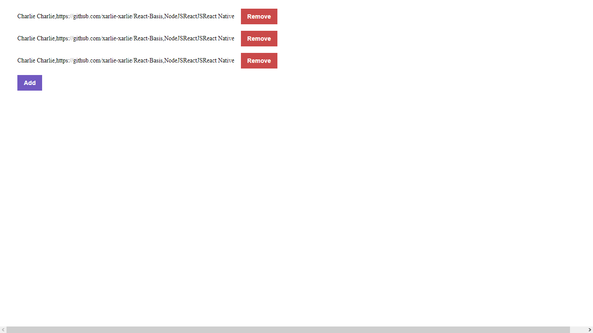
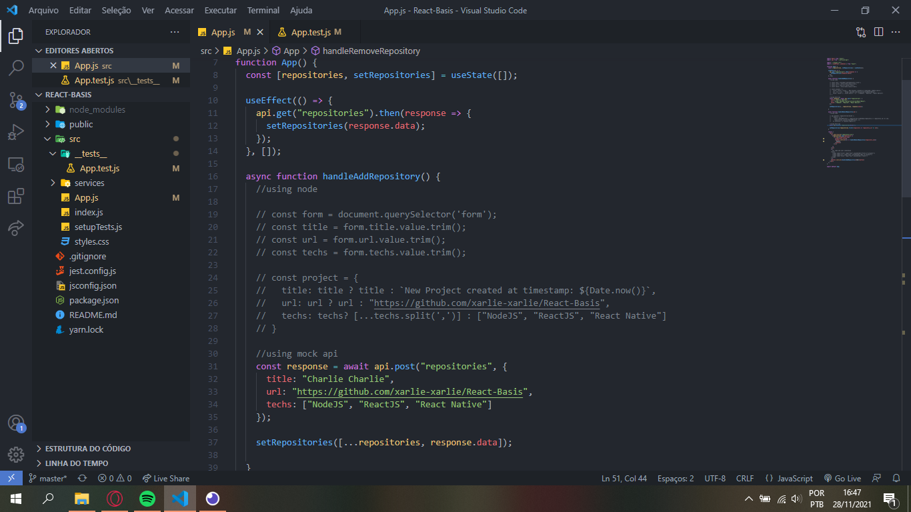

# First React App

## Application Funcionalities

- **`List your API repositories`**: You must be able to create a list with the **title** field of all repositories that are registered in your API.

- **`Add a repository to your API`**: It must be able to add a new item to its API through a button with the text **Add** and, after creation, it must be able to display the name after registration.

- **`Remove a repository from your API`**: For each item in your list, there must be a button with the text **Remove** which, when clicked, will call a function to remove that item from your list. frontend and its API.

## Tests Especifications

- **`should be able to add new repository`**: In order for this test to pass, your application must allow a repository to be added to your backend and listed in your frontend within a `LI`.

- **`should be able to remove repository`**: For this test to pass, your application must allow that when you click on the remove button that will be inside the `LI` of the added repository, the item is removed from the listing.
